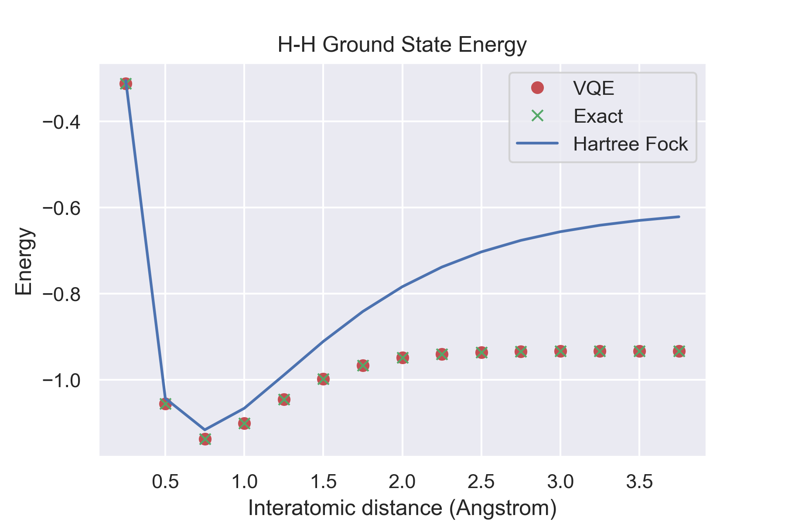

# Variational Quantum Eigensolvers with Qiskit

This project aims to demonstrate applications of the VQE algorithm towards Chemical modeling. The contained tutorials were created to supplement a final project for PHYS 660: Quantum Information and Computation. Here are [slides](https://docs.google.com/presentation/d/1w8D8VfNgCbKl2O8pETF9-ffZV4pbPakvZafk2O3QBb8/edit?usp=sharing) from our final presentation.  

## Motivation Examples

Within `tutorials/VQE.ipynb`, we have written up motivating examples to find the ground state energy of a single and two qubit system Hermitian operator. 

The single qubit VQE optimizations use the U3 gate based variational form, as shown below [1].

While the two qubit VQE optimizations use a variational form derived from *Shende et al.* [1-2]. 

## Ground State Energy of Small Molecules

Also within `tutorials/VQE.ipynb`, we have used Qiskit Aqua and Qiskit Chemistry to solve for the ground state energy of Li-H and H-H at various interatomic distances. These VQE optimizations were seeded with Hartree-Fock ansatz.

Here are the main results.

## Next Steps

We hope to later simulate VQE optimizations on noisy systems with error mitigation. Please check out our [slides](https://docs.google.com/presentation/d/1w8D8VfNgCbKl2O8pETF9-ffZV4pbPakvZafk2O3QBb8/edit?usp=sharing) to learn more!

### References
1. [Simulating Molecules using VQE Qiskit Tutorial](https://qiskit.org/textbook/ch-applications/vqe-molecules.html)
2. Shende, Vivek V., Igor L. Markov, and Stephen S. Bullock. "Minimal universal two-qubit cnot-based circuits." arXiv preprint quant-ph/0308033 (2003). 
